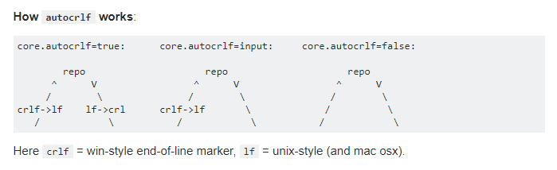

# Spotify API Course

A wrapper to work with the [Spotify Web API](https://developer.spotify.com/web-api/).

## About the course

TDD with JavaScript Course by William Justen

## Browser Support

This library relies on [Fetch API](https://fetch.spec.whatwg.org/). And this API is supported in the following browsers.

 |  |  |  |  |
--- | --- | --- | --- | --- |
39+ ✔ | 42+ ✔ | 29+ ✔ | 10.1+ ✔ | Nope ✘ |

## Important commands

1.0 - List global npm plugins

```prompt
npm list -g --depth=0
```

## Fix possible bugs

### 1.0 - Webpack > UglifyJSPlugin

Maybe you'll have some trouble with this plugin. However, you can solve this installing it separately.


```
npm i -D uglifyjs-webpack-plugin
```

#### Config your `webpack.config.js` file.

```javascript
const UglifyJSPlugin = require('uglifyjs-webpack-plugin');

[...]
plugins: [
  new UglifyJSPlugin({
    uglifyOptions: {
      compress: { warnings: false },
      output: { comments: false },
    },
    sourceMap: true,
  }),
],
```

### 2.0 - NPM Error while running the test

This is a problem when using npm run, it has to do with Mocha exiting with code !== 0 whenever a test fails.


```javascript
"scripts": {
  "test": "./node_modules/.bin/mocha specs/**/*.spec.js || ECHO.",
},
```

### Solve LF replace to CRLF on Git

This command will solve the problem with linebreak replacement on `git commit`.

```prompt
git config --global core.autocrlf input
```



## License

This project is licensed under the MIT License - see the [LICENSE](LICENSE) file for details
